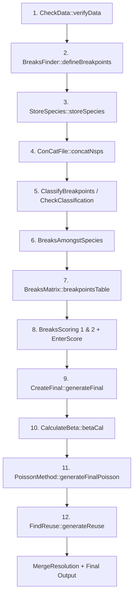
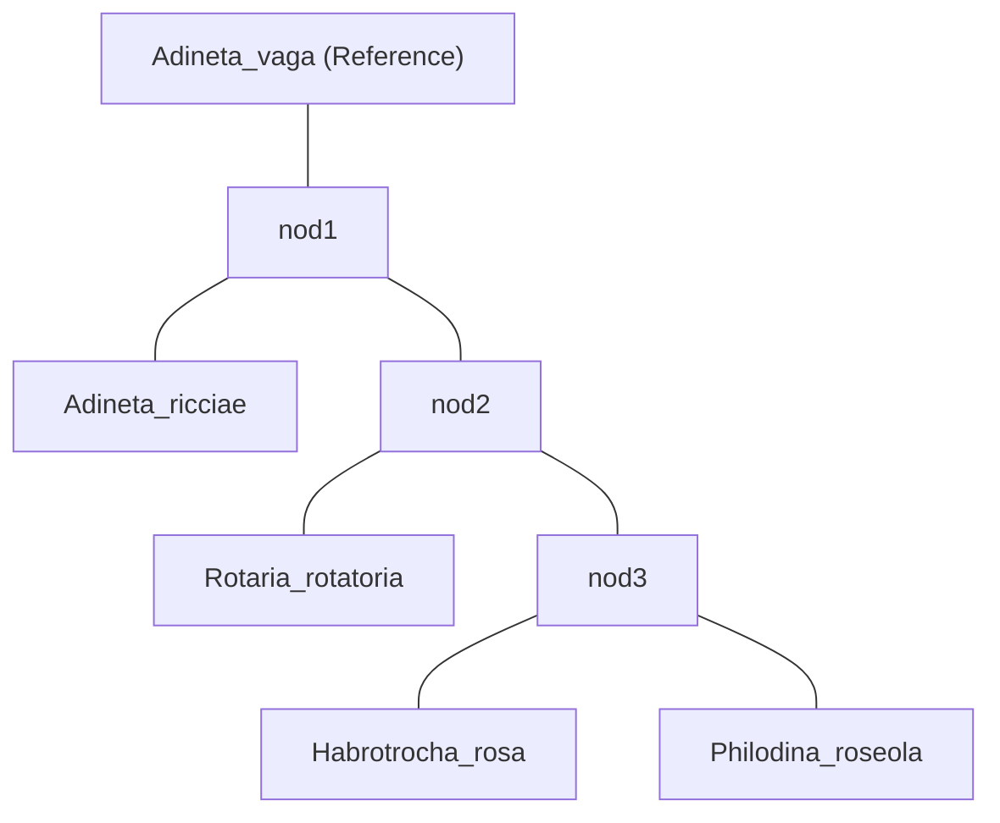

# EBA v3.0 — Evolutionary Breakpoints Analyser

[](https://india.gov.in/)
[](https://anaconda.org/jitendralab/eba3)
[](https://anaconda.org/jitendralab/eba3)
[](LICENSE)

## What It Is

EBA is a **Perl-based bioinformatics pipeline** that automatically defines, classifies, and scores **Evolutionary Breakpoint Regions (EBRs)** from pairwise synteny data across multiple genomes. It works at **multiple resolutions** simultaneously and uses a **phylogenetic classification** to determine when breakpoints occurred in evolutionary history.

> [!NOTE]
> Authors: Jitendra Narayan & Denis Larkin (original), maintained by Pranjal Pruthi.
> License: Academic Use Only.

---

## Installation via Conda

The easiest way to install EBA v3.0 is via the `jitendralab` Conda channel. This will automatically handle all Perl dependencies.

```bash
# Add required channels
conda config --add channels conda-forge
conda config --add channels bioconda

# Install EBA v3.0
conda install -c jitendralab eba3
```

After installation, the `EBA.pl` command will be available in your PATH.

---

## Command Breakdown

```bash
EBA.pl -n 5 -d EBA-input/ -r Adineta_vaga -p 300 -t 20 -c classification.eba -k -o ./EBA_results -chr chr_size.txt
```

| Flag | Value | Meaning |
|------|-------|---------|
| `-n 5` | 5 | Number of species being analyzed |
| `-d EBA-input/` | `EBA-input/` | Directory containing synteny block files, organized by resolution subfolders |
| `-r Adineta_vaga` | `Adineta_vaga` | Reference genome (all comparisons are relative to this species) |
| `-p 300` | 300 | Primary resolution (in kb) — the "anchor" resolution for beta scoring & merging |
| `-t 20` | 20 | Threshold for filtering reuse breakpoints |
| `-c classification.eba` | `classification.eba` | Custom phylogenetic classification file (skips NCBI auto-classification) |
| `-k` | flag | **Keep** intermediate files (don't delete them after the run) |
| `-o ./EBA_results` | `./EBA_results` | Custom output directory to save all final `.data`, `.gif` charts, and score files. |
| `-chr chr_size.txt` | `chr_size.txt` | Custom chromosome size file for boundary calculations |

---

## Inputs

### 1. Synteny Block Files (`EBA-input/`)

The input directory contains **resolution subfolders** (100, 300, 500 = 100kb, 300kb, 500kb minimum synteny block size):

```
EBA-input/
├── 100/       ← 5 files (one per pairwise comparison)
├── 300/       ← 5 files
└── 500/       ← 5 files
```

Each file (e.g., `vaga2_300k_nonoverlap.txt`) is a **tab-separated synteny block file** with 10 columns:

```
Col[0]: Reference:Resolution    (e.g., Adineta_vaga:300k)
Col[1]: Ref chromosome           (e.g., 1)
Col[2]: Ref block start           (e.g., 461459)
Col[3]: Ref block end             (e.g., 517200)
Col[4]: Target chromosome         (e.g., 3)
Col[5]: Target block start        (e.g., 374286)
Col[6]: Target block end          (e.g., 584261)
Col[7]: Orientation               (+ or -)
Col[8]: Target species name       (e.g., Adineta_vaga2)
Col[9]: Assembly level            (Chromosomes or Scaffolds)
```

> [!IMPORTANT]
> File naming convention: `{species_shortname}_{resolution}_{suffix}.txt` — the first token before `_` is used as the species identifier throughout the pipeline.

### 2. `classification.eba` — Phylogenetic Tree as Key-Value Pairs

```
Adineta_vaga=Adineta_ricciae,Rotaria_rotatoria,Habrotrocha_rosa,Philodina_roseola
nod1=Rotaria_rotatoria,Habrotrocha_rosa,Philodina_roseola,Adineta_ricciae
nod2=Rotaria_rotatoria,Habrotrocha_rosa,Philodina_roseola
nod3=Habrotrocha_rosa,Philodina_roseola
```

This encodes the **phylogenetic topology** as a series of ancestral nodes:
- **Line 1**: Reference species + all target species (root)
- **nod1**: Species below the first divergence from the reference
- **nod2**: A smaller clade
- **nod3**: The most closely related pair

This is used to **classify** each breakpoint as occurring on a specific evolutionary branch.

### 3. `chr_size.txt` — Reference Chromosome Sizes

```
1    18146847
2    16274841
3    20354754
4    15224634
5    16930519
6    13893210
```

Tab-separated: chromosome ID + size in bp. Used by `BreaksFinder` to define **telomeric pseudo-breakpoints** at chromosome ends.

---

## Processing Pipeline (12 Stages)

The main loop in `EBA.pl` iterates over each resolution subfolder and executes:



### Stage Details

| # | Module | What it does |
|---|--------|-------------|
| 1 | `CheckData` | Validates input file count matches `-n` species count, checks format |
| 2 | `BreaksFinder` | **Core algorithm**: identifies breakpoints between adjacent synteny blocks. Distinguishes `Break` vs `PseudoBreak` based on whether the gap falls at scaffold boundaries (for scaffold-level assemblies) or is internal to a chromosome |
| 3 | `StoreSpecies` | Records each species name & assembly level (Chromosomes/Scaffolds) → `species.sps` |
| 4 | `ConCatFile` | Concatenates species names into comma-separated list → `sps.txt` |
| 5 | `ClassifyBreakpoints` | Auto-generates classification from NCBI taxonomy OR uses provided `-c` file. `CheckClassification` validates it. `ModifyClassification` can exclude singleton groups (`-x` flag) |
| 6 | `BreaksAmongstSpecies` | Cross-references breakpoints across all species at each resolution |
| 7 | `BreaksMatrix` | Builds a breakpoint co-occurrence matrix |
| 8 | `BreaksScoring 1 & 2` + `EnterScore` | Two-pass scoring of breakpoints, then scores are entered back into data |
| 9 | `CreateFinal` | Generates the final annotated breakpoint file per resolution |
| 10 | `CalculateBeta` | **Beta score algorithm** (see below) — compares breakpoints across resolutions |
| 11 | `PoissonMethod` | Applies Poisson statistical model to determine breakpoint significance and lineage assignment |
| 12 | `FindReuse` | Identifies **reused breakpoints** — regions that broke independently on multiple evolutionary branches (threshold filtered by `-t`) |

### After All Resolutions: Merge Phase

- `MergeResolution::mergeAll` — Merges results from all resolutions using the **prime resolution** (`-p 300`) as the anchor
- `FindReuseMerge` — Calculates reuse on merged data
- Generates numerous **GIF visualizations** (pie charts, stacked bars, line graphs)
- Produces `final_classify.final` — the **ultimate output** with select columns removed for clarity

---

## Outputs

### Written to CWD (where `EBA.pl` runs):

| File | Content |
|------|---------|
| **`betaScore`** | Beta scores per species per resolution. Format: `resolution:species_name\tbeta_value`. Beta ∈ [0,1] measures the fraction of breakpoints that are **artifacts of resolution** (missed at a given resolution but found at flanking ones) |
| **`gaps_brks.stats`** | Per-species statistics: total segments, real breaks, gaps, telomeres, final gaps — tabulated for every resolution |
| **`species.sps`** | Species names + assembly level (Chromosomes/Scaffolds), one per line per resolution pass |
| **`sps.txt`** | Comma-separated list of all species names (single line) |
| **`final_classify.final`** | The **main result** — classified and scored breakpoints with evolutionary branch assignments |

### Written to `EBA_OUT/` subdirectories:

| Directory | Content |
|-----------|---------|
| `EBA_OUT/{resolution}/EBA_OutFiles/` | Intermediate `.eba` breakpoint files per species |
| `EBA_OUT/{resolution}/EBA_ImageFiles/` | GIF visualizations per resolution |
| `EBA_OUT/{resolution}/ResultFiles/` | Scored/classified result files per resolution |
| `EBA_OUT/Merge/` | All merged `.final`, `.data`, and `.gif` files |

---

## The Beta Score Algorithm

The beta score is EBA's **quality metric** — it measures how resolution-dependent a breakpoint is.

```
β = missed_breakpoints / (missed_breakpoints + real_breakpoints)
```

Where:
- **Real breakpoint**: A break found at resolution R that is **also present** in at least one flanking resolution (R-1 or R+1)
- **Missed breakpoint**: A break found at a flanking resolution but **NOT at R** (i.e., it was missed/absorbed)

Detection uses **coordinate overlap checking** — if a breakpoint region at one resolution overlaps a breakpoint at another resolution, they are considered the same break.

- **Low β** (near 0) → breakpoints are robust across resolutions (good)
- **High β** (near 1) → breakpoints are resolution-specific artifacts (bad)

The beta score requires **≥3 resolutions** to calculate meaningfully (lower, middle, upper comparisons).

---

## Break Detection Logic (BreaksFinder)

Two distinct algorithms depending on assembly level:

### Chromosomes mode:
- Sort synteny blocks by chromosome → start coordinate
- Walk adjacent blocks: the **gap between two consecutive blocks on the same reference chromosome** = a breakpoint
- Breakpoint coordinates = `[end_of_block_N, start_of_block_N+1]`
- Chromosome start and end get `PseudoBreak` labels (telomeric boundaries)
- The `-i` flag can increase/decrease breakpoint region size

### Scaffolds mode:
- Same gap-detection logic, PLUS additional checks:
- Looks at whether the gap falls at the **boundary of a scaffold** in the target species
- If the break falls at a scaffold boundary → `PseudoBreak` (it's an assembly artifact, not a real evolutionary breakpoint)
- If the break falls **within** a scaffold → `Break` (real evolutionary breakpoint)

---

## Species in This Dataset (5 Bdelloid Rotifers)

| Species | Assembly Level |
|---------|---------------|
| Adineta_vaga2 | Chromosomes (REFERENCE) |
| Adineta_ricciae | Scaffolds |
| Habrotrocha_rosa | Chromosomes |
| Philodina_roseola | Chromosomes |
| Rotaria_rotatoria | Scaffolds |

### Phylogenetic Relationships (from classification.eba):



---

## Module Architecture

```
EBA.pl (main orchestrator)
└── EBALib/
    ├── CheckData.pm          — Input validation
    ├── BreaksFinder.pm       — Core: identify breakpoints from synteny blocks
    ├── StoreSpecies.pm       — Extract & store species metadata
    ├── ConCatFile.pm         — Concatenate species lists
    ├── ClassifyBreakpoints.pm — Auto-classify using NCBI taxonomy
    ├── CheckClassification.pm — Validate classification file
    ├── ModifyClassification.pm — Alter classification (exclude singletons)
    ├── BreaksAmongstSpecies.pm — Cross-species breakpoint comparison
    ├── BreaksMatrix.pm       — Build breakpoint matrix
    ├── BreaksScoring.pm      — Breakpoint scoring pass 1
    ├── BreaksScoring2.pm     — Breakpoint scoring pass 2
    ├── EnterScore.pm         — Apply scores to breakpoints
    ├── ConCatAll.pm          — Concatenate all results
    ├── CreateFinal.pm        — Generate final annotated output
    ├── CalculateBeta.pm      — Beta score calculation
    ├── ModifyBeta.pm         — Adjust beta scores for prime resolution
    ├── PoissonMethod.pm      — Statistical significance via Poisson model
    ├── FindReuse.pm          — Detect reused breakpoints
    ├── FindReuseMerge.pm     — Detect reuse in merged data
    ├── MergeResolution.pm    — Merge across resolutions
    ├── CommonSubs.pm         — Utility functions (trim, unique, overlap check)
    ├── Messages.pm           — All user-facing messages
    ├── Safai.pm              — Cleanup routines
    └── Draw/                 — 17 visualization modules (GIF output)
        ├── drawPieChart.pm
        ├── drawPieChartFinal.pm
        ├── drawCumulatedBar.pm
        ├── drawCumulatedStackedBar.pm
        ├── drawBrkChrLineGraphFinal.pm
        ├── drawBreakpointChrGraphFinal.pm
        └── ... (11 more)
```
